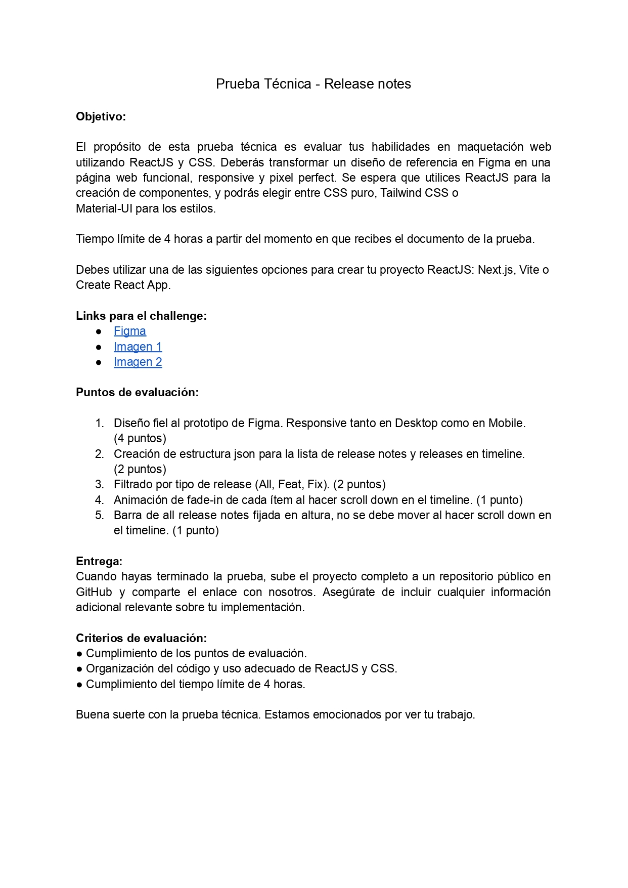
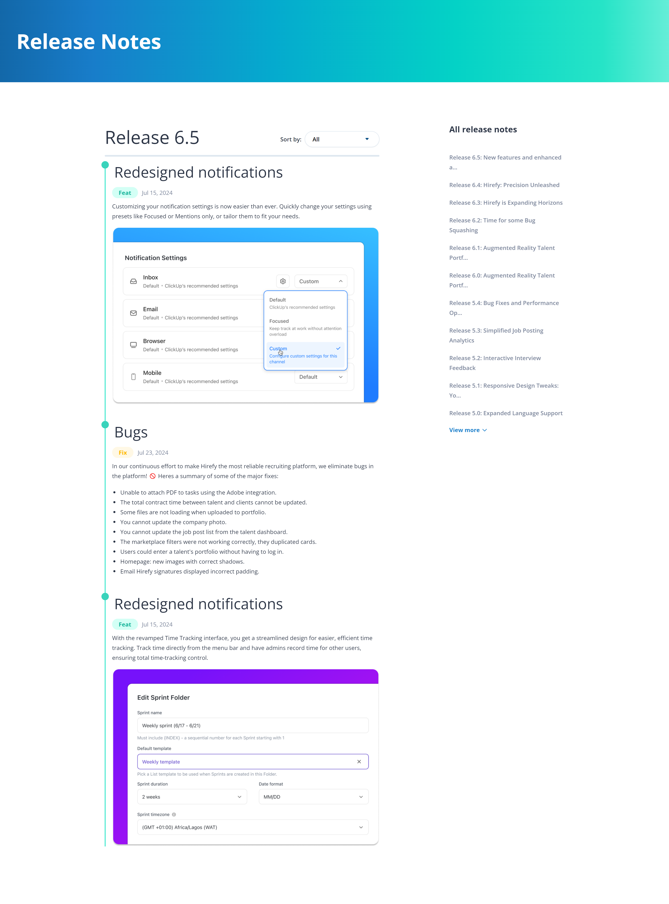
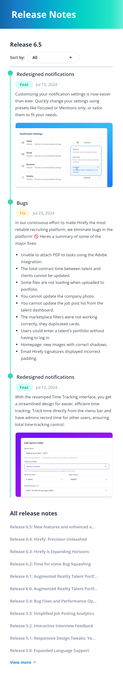

# Prueba técnica Hirefy

## Descripción
Este proyecto es una solución desarrollada como parte de la prueba técnica para demostrar mis habilidades en React, CSS y Tailwind

## Características Implementadas
- [ ] Diseño fiel al prototipo de Figma. Responsive tanto en Desktop como en Mobile
- [ ] Creación de estructura json para la lista de release notes y releases en timeline
- [ ] Filtrado por tipo de release
- [ ] Animación de fade-in de cada ítem al hacer scroll down en el timeline
- [ ] Barra de all release notes fijada en altura, no se debe mover al hacer scroll down en
el timeline. 

## Capturas de Pantalla
A continuación se muestran algunas capturas de pantalla del proyecto:

